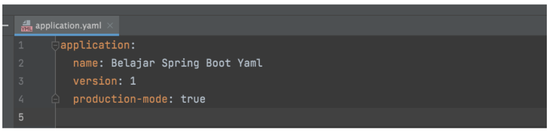
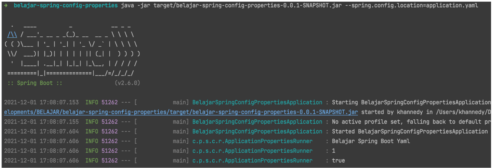

# Yaml

- Selain menggunakan file properties, Spring Boot juga mendukung penggunaan file Yaml
- Caranya sangat mudah, kita bisa mengganti semua file properties yang kita gunakan menjadi file Yaml
- File Yaml sangat mempermudah ketika kita membuat configuration yang sangat kompleks

# Contoh File Yaml

# Kode Menjalankan Dengan Yaml

